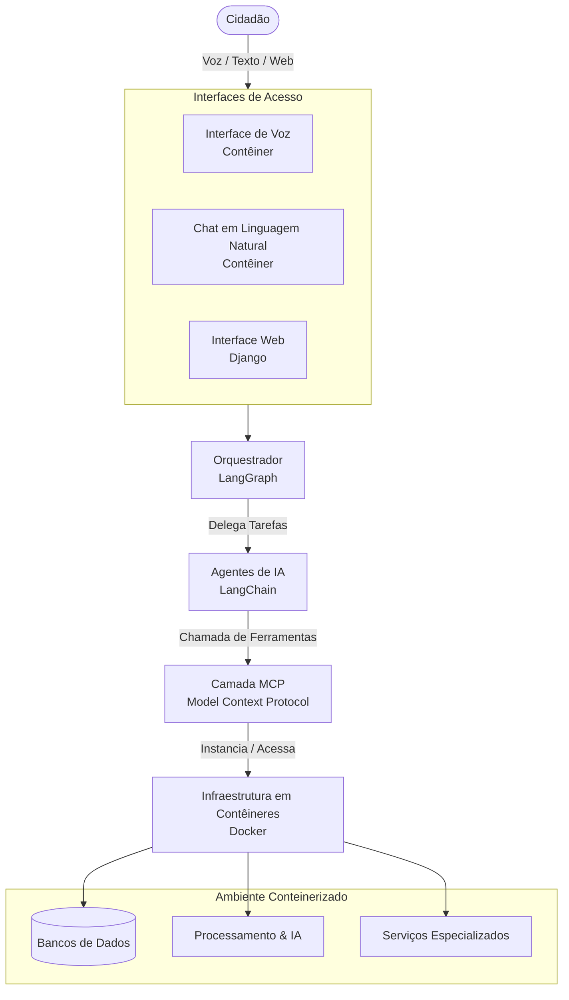

# Inteligência Aberta

> Agentes de IA a serviço de cada cidadão — transformando dados públicos e privados em inteligência acionável, rastreável e ética.

[](https://github.com/bonafe/inteligencia-aberta)
[](LICENSE)
[](https://www.python.org/)

---

## Manifesto

A inteligência não pode ser privilégio.

Durante séculos, ter acesso a boas informações, assessoria jurídica, acompanhamento financeiro, orientação médica e suporte para lidar com a burocracia do Estado foi algo reservado a quem podia pagar. O cidadão comum navegou sozinho por sistemas opacos, formulários incompreensíveis e decisões que afetam sua vida sem que ninguém ao seu lado soubesse explicá-las direito.

A IA muda isso — ou deveria mudar.

Acreditamos que cada cidadão tem o direito a um agente inteligente trabalhando para ele. Um agente que entenda sua linguagem, conheça seu contexto, guarde sua história com segurança e o ajude a tomar decisões melhores sobre saúde, finanças, impostos, direitos e tudo mais que compõe uma vida em sociedade. Não uma ferramenta para especialistas. Uma extensão da capacidade humana, acessível a qualquer pessoa.

Governos têm o dever de garantir esse acesso. Assim como o Estado provê educação, saúde e infraestrutura, deve prover acesso a modelos de linguagem e agentes inteligentes como serviço público. Excluir alguém dessa tecnologia é aprofundar a desigualdade em sua forma mais perversa — a desigualdade de capacidade de entender e agir sobre o próprio mundo.

Este projeto nasce dessa convicção.

---

## Visão

O **Inteligência Aberta** é uma plataforma de agentes de IA construída para devolver poder de análise e ação ao cidadão. Começa com fontes abertas — OSINT — mas vai além: o usuário pode trazer seus próprios dados sigilosos, e o sistema os guarda com segurança, nunca os expondo sem autorização explícita.

A plataforma deve ser acessível a qualquer pessoa. Isso significa que a interface não pode exigir conhecimento técnico. Conversa em linguagem natural é o padrão. Voz é um caminho natural para quem prefere falar a digitar — e essa interface, entregue como um container especializado, é parte integral da arquitetura, não um recurso secundário.

### Onde queremos chegar

- Um cidadão consegue entender sua declaração de imposto de renda conversando com o agente em voz.
- Uma pessoa idosa pergunta ao agente sobre seus direitos previdenciários e recebe uma resposta clara, no seu vocabulário.
- Um empreendedor de baixa renda obtém análise financeira do seu negócio que antes custaria uma consultoria.
- Um morador de periferia entende e acompanha processos judiciais que afetam sua comunidade.
- Dados sensíveis do usuário — documentos, contratos, histórico médico — ficam sob sua posse e controle, compartilhados apenas quando e com quem ele decidir.

Esse é o horizonte. A arquitetura técnica descrita abaixo é o caminho para chegar lá.

---

## Princípios Fundamentais

| Princípio | Descrição |
|---|---|
| **Inteligência como direito** | Todo cidadão merece um agente trabalhando para ele, independente de renda, escolaridade ou habilidade tecnológica. |
| **Dados sob controle do usuário** | O usuário decide o que guardar, o que compartilhar e com quem. Dados sigilosos nunca saem sem autorização explícita. |
| **Acesso por linguagem natural** | A interface padrão é conversa — texto ou voz. Não exigimos letramento digital para usar inteligência digital. |
| **Baseado em evidência** | Toda conclusão possui uma fonte rastreável associada. Sem fonte, sem dado. |
| **Separação de conceitos** | O sistema diferencia explicitamente: *fato*, *opinião* e *inferência da IA*. |
| **Rastreabilidade ponta a ponta** | O ciclo de vida completo de cada informação pode ser auditado. |
| **Modularidade** | Blocos independentes — cada componente pode ser atualizado ou substituído sem afetar os demais. |
| **Human-in-the-loop** | Casos sensíveis e decisões críticas sempre passam por revisão humana. |
| **Multi-tenancy por design** | Dados de diferentes usuários e organizações isolados logicamente desde a origem. |
| **Governança ética** | Conformidade com LGPD e boas práticas de inteligência. Dados sensíveis nunca trafegam para LLMs externos sem autorização explícita. |
| **Escalabilidade horizontal** | Arquitetura pronta para crescimento com adição de nós computacionais. |

---

## O que é tecnicamente

**Inteligência Aberta** é uma plataforma modular que utiliza agentes de IA para coletar, correlacionar, validar e sintetizar dados — públicos ou privados — entregando análises estruturadas com rastreabilidade completa de cada informação.

O sistema é construído sobre três pilares:

- **Agentes especializados** que dividem o trabalho investigativo (planejamento, coleta, extração, correlação, validação, análise e redação).
- **Infraestrutura em contêineres** que garante isolamento, modularidade e escalabilidade de cada componente — incluindo interfaces de voz e linguagem natural como contêineres de primeira classe.
- **Protocolo MCP** como camada de integração entre a IA e a infraestrutura — descobrindo e acionando ferramentas dinamicamente.

---

## Arquitetura



### Agentes Especializados

O sistema opera com múltiplos agentes, cada um com responsabilidade clara dentro do ciclo de inteligência:

- **Planejador** — define a estratégia investigativa
- **Coletor** — obtém dados de fontes variadas
- **Extrator** — retira informações específicas de textos e documentos
- **Correlacionador** — encontra conexões e padrões entre dados díspares
- **Validador** — audita qualidade e veracidade das informações
- **Analista** — gera insights a partir do material coletado
- **Redator** — sintetiza resultados em linguagem natural clara

### Classificação e Confidencialidade

Todos os dados carregam metadados obrigatórios de classificação que determinam quais ferramentas, LLMs e contêineres podem ser utilizados:

```json
{
  "tenant_id": "cidadao_x",
  "classificacao": "restrito",
  "compartilhamento": ["usuario_y", "grupo_juridico"],
  "permitir_llm_externo": false
}
```

Níveis: `público` → `interno` → `restrito` → `confidencial`

Dados classificados como `restrito` ou `confidencial` só trafegam para modelos rodando localmente (on-premise), nunca para LLMs externos.

---

## Interfaces de Linguagem Natural e Voz

A interface por voz e linguagem natural não é um recurso futuro — é parte central da arquitetura desde o início. Ela existe como um contêiner independente, substituível e evoluível sem impactar os demais componentes.

A motivação é clara: tecnologia que exige habilidade tecnológica para ser usada exclui exatamente as pessoas que mais se beneficiariam dela. Uma interface de voz bem implementada permite que:

- Pessoas com baixo letramento digital interajam naturalmente com o sistema.
- Usuários com deficiência visual ou motora acessem as funcionalidades sem barreiras.
- Qualquer pessoa use o sistema da forma mais humana possível — falando.

Isso não é acessibilidade como concessão. É o design correto para uma ferramenta que se pretende universal.

---

## Stack Tecnológica

| Camada | Tecnologia |
|---|---|
| Backend Core / APIs | Python + FastAPI |
| Interface de Usuário | Django |
| Interface de Voz | Container dedicado (STT + TTS) |
| Orquestração de Agentes | LangGraph |
| Modelos e Tooling (LLM) | LangChain |
| Integração Sistêmica | MCP (Model Context Protocol) |
| Infraestrutura | Docker |
| Banco Relacional | PostgreSQL |
| Banco Vetorial (RAG) | Qdrant / pgvector |
| Banco de Grafos | Neo4j |
| Armazenamento de Objetos | MinIO (S3 Compatible) |

---

## Status do Projeto

**MVP (fase atual):** Execução local / servidor único via `docker-compose`.

**Roadmap:**
- [ ] Interface web operacional (Django)
- [ ] Orquestração básica com LangGraph
- [ ] Tools iniciais via MCP (`consultar_cnpj`, `buscar_processos`, `buscar_noticias`)
- [ ] Pipeline RAG para análise de documentos
- [ ] Multi-tenancy com isolamento por organização
- [ ] Interface de linguagem natural (chat)
- [ ] Interface de voz (container STT/TTS)
- [ ] Suporte a modelos locais (on-premise) para dados sensíveis
- [ ] Escalabilidade horizontal (Kubernetes / Docker Swarm)

---

## Documentação

A especificação arquitetural completa do projeto está disponível em [`docs/especificacao.md`](docs/especificacao.md).

---

## Aviso Ético e Legal

Este projeto é desenvolvido para fins de **inteligência legítima sobre fontes abertas (OSINT)** e para **empoderamento do cidadão**. O uso desta plataforma deve respeitar integralmente:

- A **Lei Geral de Proteção de Dados (LGPD)** e demais legislações de privacidade aplicáveis.
- Os **termos de uso** de todas as fontes e APIs consultadas.
- Boas práticas de ética em coleta e análise de dados.

O uso indevido desta plataforma para vigilância ilegal, assédio ou qualquer finalidade contrária às leis vigentes é de **total responsabilidade do operador**.

---

## Licença

Distribuído sob a licença [MIT](LICENSE). © 2026 Fernando Bonafé.
