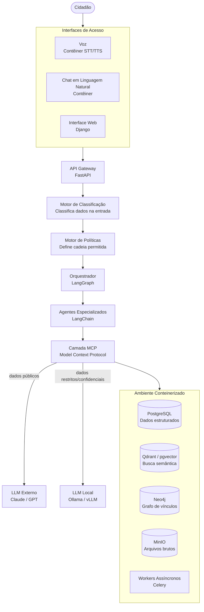

# Arquitetura — Visão Geral

## Premissa

A arquitetura deve servir cidadãos comuns, não apenas analistas técnicos. Isso impõe restrições reais: interfaces de voz como cidadãs de primeira classe, processamento local para dados sensíveis, e modularidade que permita substituir qualquer peça sem derrubar o sistema.

---

## Diagrama Macro



---

## Camadas

### Camada 1 — Interfaces de Acesso

Três interfaces, todas tratadas como contêineres de primeira classe:

- **Voz:** Transcreve fala em texto (STT), entrega resposta em áudio (TTS). Prioridade máxima para acessibilidade.
- **Chat:** Conversa em linguagem natural. Principal interface para a maioria dos usuários.
- **Web:** Interface operacional completa — gestão de configurações, visualização de relatórios, administração.

Todas as interfaces convergem para o mesmo API Gateway. Nenhuma tem lógica de negócio — são apenas formas de entrada e saída.

### Camada 2 — Gateway e Classificação

Toda requisição passa por dois filtros antes de chegar aos agentes:

1. **Motor de Classificação:** Detecta ou recebe a classificação do dado (`público`, `interno`, `restrito`, `confidencial`). Dados sem classificação explícita recebem `restrito` por padrão.

2. **Motor de Políticas:** Com base na classificação, define a cadeia de execução: quais LLMs podem ser usados, quais ferramentas são permitidas, quais contêineres podem ser acessados.

### Camada 3 — Orquestração e Agentes

- **LangGraph** gerencia o estado da investigação como uma máquina de estados explícita. Cada etapa do ciclo de inteligência é um nó com entradas e saídas definidas.
- **Agentes LangChain** executam tarefas especializadas. Cada agente tem escopo limitado — nenhum agente faz tudo.

### Camada 4 — MCP (Model Context Protocol)

Camada de integração entre IA e infraestrutura. O MCP descobre ferramentas disponíveis, instancia contêineres sob demanda e aplica políticas de confidencialidade antes de cada chamada.

Detalhado em: [`../componentes/mcp.md`](../componentes/mcp.md)

### Camada 5 — Infraestrutura

Cada componente de infraestrutura é um contêiner isolado. Falha de um não derruba os outros.

| Contêiner | Função |
|---|---|
| PostgreSQL | Dados estruturados, metadados, configurações |
| Qdrant / pgvector | Embeddings para busca semântica (RAG) |
| Neo4j | Grafo de vínculos entre entidades |
| MinIO | Arquivos brutos (PDFs, imagens, áudios) |
| Celery Workers | Processamento assíncrono (indexação, alertas) |

---

## Fluxo de Dados com Classificação

```
Entrada do usuário
      ↓
Classificação do dado (automática ou explícita pelo usuário)
      ↓
Motor de Políticas determina:
  - LLM local ou externo
  - Ferramentas permitidas
  - Contêineres acessíveis
      ↓
Execução controlada pelo orquestrador
      ↓
Resultado entregue com rastreabilidade completa
```

Nenhum dado muda de classificação durante a execução. A classificação é imutável para aquele ciclo. Se o usuário quiser reclassificar, é uma nova operação explícita.

---

## Princípios Arquiteturais

1. **Negação por padrão:** Sem permissão explícita, o dado não vai a lugar nenhum.
2. **Contêineres como unidade:** Qualquer funcionalidade nova entra como contêiner. Nunca como código embutido no núcleo.
3. **Rastreabilidade de ponta a ponta:** Toda conclusão carrega a cadeia de fontes que a originou.
4. **LLM como ferramenta, não como árbitro:** O LLM processa e sintetiza. Decisões de política são do Motor de Políticas — código determinístico.
5. **Revisão humana em casos sensíveis:** Configurável por tipo de operação e nível de confiança.

---

## Referências

- Componentes detalhados: [`../componentes/`](../componentes/)
- Decisões arquiteturais: [`./decisoes/`](./decisoes/)
- Modelo de dados: [`./modelo-de-dados.md`](./modelo-de-dados.md)
- Segurança e classificação: [`../seguranca/classificacao.md`](../seguranca/classificacao.md)
